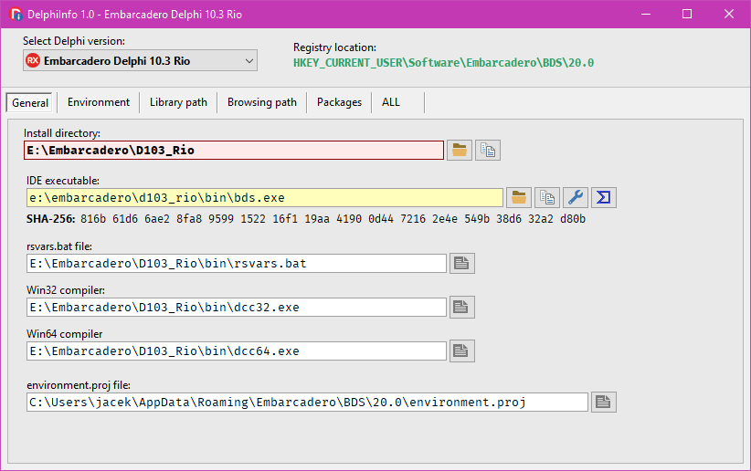
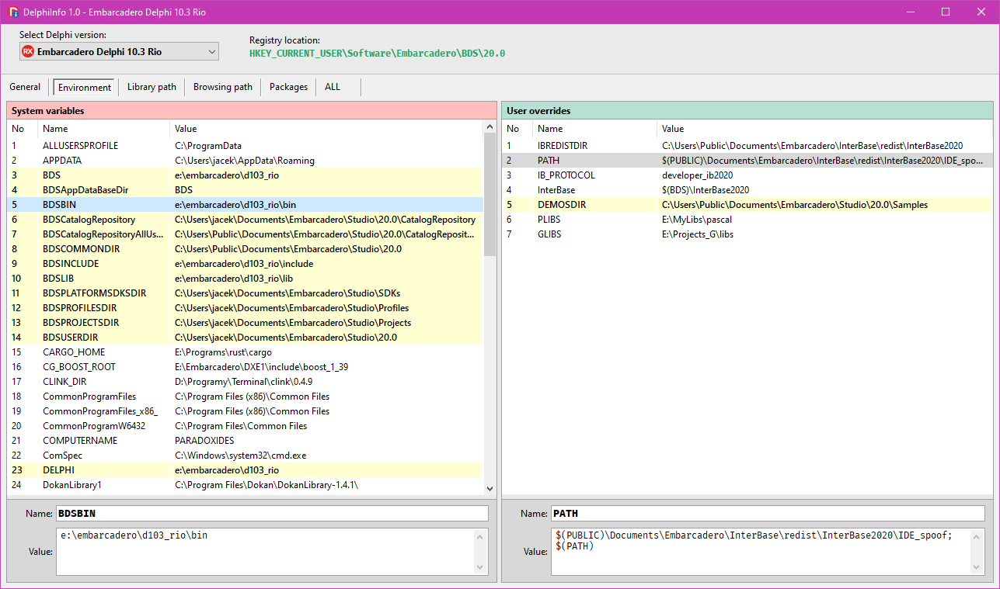
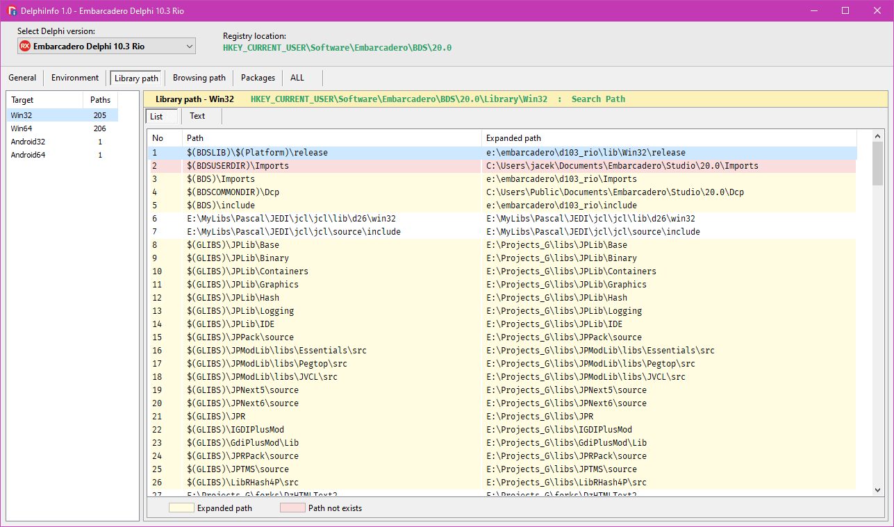
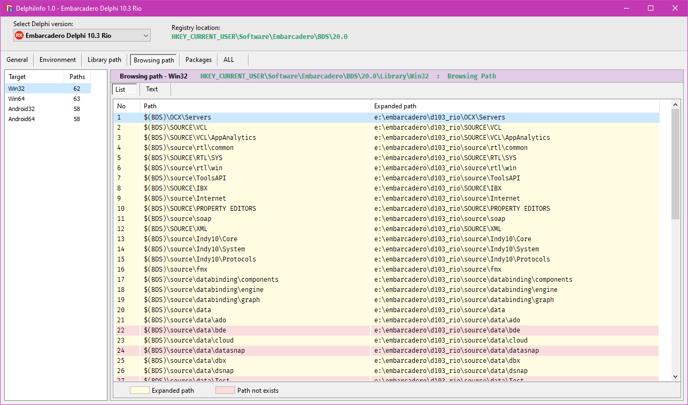
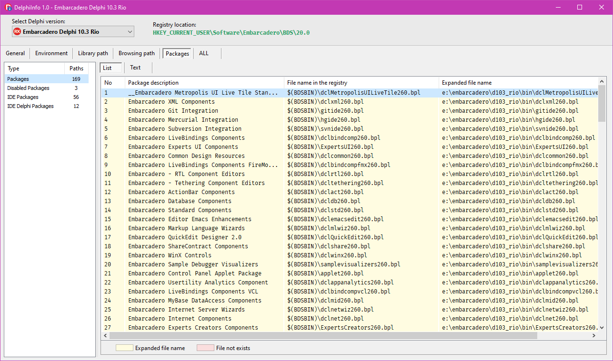

# DelphiInfo

## Overview

The program displays detailed information about the installed versions of the Delphi environment.

Supported versions: Borland Delphi 7 - Embarcadero Delphi 11.0 Alexandria

The program is not finished yet, but is already working.

Compiled binaries (32 & 64-bit): <https://www.pazera-software.com/files/DelphiInfo.zip>

## Compilation

You need:

* [JCL](https://github.com/project-jedi/jcl)
* [JVCL](https://github.com/project-jedi/jvcl)
* [PngComponents](https://github.com/UweRaabe/PngComponents)
* [JPLib](https://github.com/jackdp/JPLib)
* [JPPack](https://github.com/jackdp/JPPack)
* [SynEdit](https://github.com/SynEdit/SynEdit)
* [Hashing unts](https://github.com/jackdp/www.wolfgang-ehrhardt.de)

## Screenshots

### General

### Environmnet

### Library Path

### Browsing Path

### Packages

